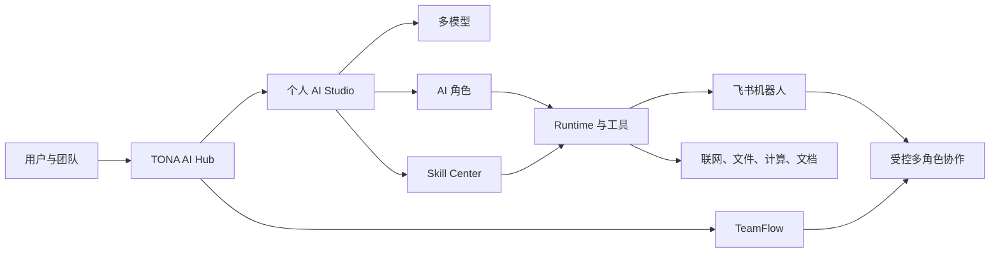

# TONA AI Studio · OpenWorker Core

> 把 OpenWorker 的计划、Todo、文件与终端能力，连接到 TONA 的 Agent、Skill、飞书和 24 小时在线工作区。

[在线体验](https://tona-agent-studio.onrender.com/) · [OpenWorker 内核说明](docs/OPENWORKER_CORE.md) · [申请接入](#申请接入) · [能力概览](#现在可以做什么) · [安全与边界](#安全与边界)

**当前阶段：Private Beta / 邀请制内测**

TONA 不是另一个聊天框。它是 OpenWorker 的线上产品层：保留可配置的 Agent、Skill、记忆、飞书入口和 Render 常驻服务，把任务规划、Todo、工具、文件、终端、审批与中断交给 OpenWorker 执行。旧 TONA Runtime 仅作为可显式选择的回退。



## 为什么是 AI Harness

单独接入一个模型，只解决了“能回答”。真正进入日常工作，还需要处理更多问题：

- **模型层**：OpenAI、DeepSeek、Kimi、豆包等模型如何按任务选择。
- **角色层**：科研、日常、代码等助手如何保持稳定职责与表达方式。
- **技能层**：研究、报告、文案和质量检查如何沉淀为可复用流程。
- **工具层**：搜索、文件、计算、结构化数据和飞书文档如何安全调用。
- **记忆层**：机器人如何理解群聊上下文，而不是每次从零开始。
- **协作层**：多个机器人如何互相 `@`、讨论、收敛，并在上限内停止。
- **治理层**：工作区、密钥、权限、确认操作和用量如何被隔离与管理。

TONA 把这些层连接起来，让 AI 从“一个会聊天的模型”变成“可以配置、调用、协作和交付的数字工作伙伴”。

## 现在可以做什么

| 能力 | 当前支持 |
| --- | --- |
| 多模型接入 | OpenAI、DeepSeek、Kimi / Moonshot、豆包 / 火山方舟，以及 OpenAI-compatible API |
| OpenWorker 内核 | 内嵌或远程部署；支持 Cowork / Code / Chat、会话、Todo、工具轨迹、审批、中断与续做 |
| AI 角色 | 创建和编辑角色定位、目标、边界、风格、输出格式、模型与技能 |
| Skill Center | 配置研究、报告、写作、审校等可复用技能和顺序工作流 |
| 飞书机器人 | 一个飞书应用机器人绑定一个角色；统一公网回调，按工作区与 App ID 路由 |
| 群聊记忆 | 读取近期会话、引用链和群内知识；未 `@` 的内容可进入上下文但不会触发回复 |
| 多角色协作 | 机器人通过真实 `@` 交接任务，最多 5 个参与角色、10 条协作消息，并最终 `@` 发起人交付 |
| 飞书文档 | 读取明确授权的文档；经确认后创建带标题、段落、列表和表格的飞书文档 |
| Runtime 工具 | 联网搜索与网页读取、日期时间、数学、单位换算、统计和结构化表格处理 |
| 工作区文件 | 上传、搜索、读取、版本、下载、重命名、删除及生成 Markdown / HTML / JSON / CSV |
| TeamFlow | 团队邀请码、成员角色、需求、任务、提醒与协作空间 |
| 用量治理 | 模型与 Runtime 调用摘要、错误记录和成本观察 |

## 典型使用方式

### 个人 AI 团队

为科研、日常和代码工作分别配置角色。每个角色可以使用不同模型、技能和飞书机器人，同时共享受控的工具体系。

### 飞书里的数字员工

在单聊或群聊中 `@` 指定机器人发起任务。机器人可以读取当前对话上下文、调用工具、生成飞书文档，并在协作任务中 `@` 其他角色继续推进。

### 研究与内容生产

把材料、网页或工作区文件交给科研助手，完成检索、分析、审校和结构化交付；再由内容角色转成报告、文章或飞书文档。

### 小团队协作

通过 TONA AI Hub 登录个人工作区；需要团队协作时，使用 Team Key 加入 TeamFlow。个人模型密钥与机器人配置不会暴露给其他成员。

## 从注册到飞书使用

1. 登录 [TONA AI Hub](https://tona-agent-studio.onrender.com/)，进入自己的 AI Studio。
2. 添加自己的模型 API Key，并测试连接。
3. 选择默认角色或创建专属角色，绑定模型和技能。
4. 在飞书开放平台创建应用机器人，并在 Studio 中填写 App ID、Secret、Verification Token 与 Encrypt Key。
5. 把 Studio 生成的专属回调 URL 填入飞书“事件与回调”，订阅接收消息事件并发布应用版本。
6. 在飞书中 `@机器人` 开始工作；复杂任务可明确要求多角色协作。

> TONA 使用 BYOK（Bring Your Own Key）模式。模型费用由相应模型服务商按你的实际调用收取。

## 安全与边界

- **工作区隔离**：用户只能访问自己的模型、角色、机器人、文件和运行记录。
- **密钥保护**：API Key 与应用 Secret 在界面中仅显示遮罩；配置 `TONA_SECRETS_KEY` 后加密落盘。
- **明确触发**：飞书群聊默认只有真实 `@` 才触发回复，避免机器人干扰日常沟通。
- **受控协作**：机器人可以互相 `@`，但参与者和消息轮次均有硬上限，防止无限循环。
- **高影响操作确认**：创建文档等写入动作通过确认卡片执行，不静默修改用户资源。
- **权限按需申请**：工具缺少飞书权限时，系统可返回能力说明与授权提示。

## 产品结构

| 模块 | 作用 |
| --- | --- |
| TONA AI Hub | 统一登录、个人工作区与团队入口 |
| AI Studio | 管理模型、角色、技能、飞书机器人、文件和运行记录 |
| Agent Runtime | 为角色提供工具调用、上下文、记忆与执行边界 |
| Feishu Connector | 事件路由、消息回复、卡片、文档与多机器人协作 |
| TeamFlow | 团队成员、需求、任务、提醒和交付管理 |

## 正在继续升级

- 更完整的飞书云文档、表格、日历和项目能力。
- 更稳定的长期记忆、知识检索与上下文压缩。
- 国内外搜索源的质量路由、引用和失败降级。
- Skill Creator、测试评估和技能版本管理。
- 独立实例、专属域名与组织级运维方案。

## 申请接入

TONA 当前采用邀请制和协助式接入，适合希望把个人 AI 或多机器人团队接入飞书的用户。

- **在线入口**：[tona-agent-studio.onrender.com](https://tona-agent-studio.onrender.com/)
- **微信咨询**：`hi342273281`
- **可提供**：账号开通、模型接入、角色设计、飞书应用配置、多机器人协作规则与独立部署。

## 开发与部署

本仓库是 TONA 产品代码库。部署、飞书回调和运行维护说明位于 `docs/`。

本地启动：

```bash
npm install
npm start
```

默认地址：`http://localhost:7357`

健康检查：`GET /api/health`

## 使用与授权声明

Copyright © TONA. All rights reserved.

当前未提供开源许可。仓库可访问不代表授予复制、修改、分发、部署或商业使用权；产品接入与商业授权请通过上述联系方式咨询。


Harness implementation and governance rules: docs/HARNESS_ARCHITECTURE.md
Optional isolated Python worker: python-runner/README.md
